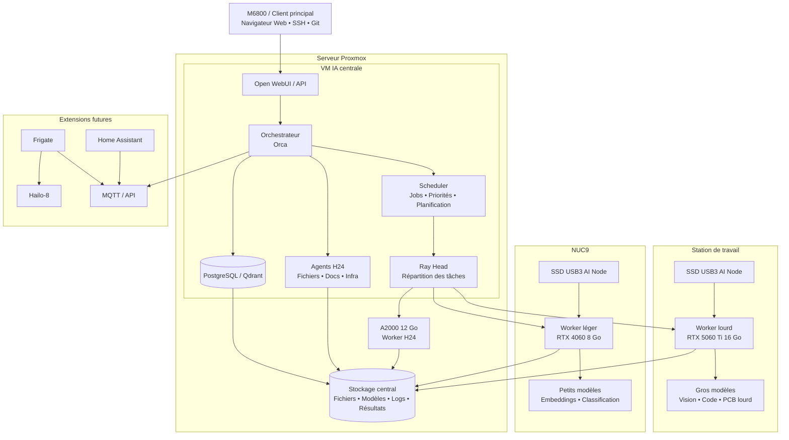

# Schéma global de l’architecture

## Version Mermaid



## Version texte simple

```text
                           ┌──────────────────────────────┐
                           │       M6800 / Client         │
                           │    Web UI • SSH • Git        │
                           └──────────────┬───────────────┘
                                          │
                                          ▼
                    ┌────────────────────────────────────────────┐
                    │            Serveur Proxmox                 │
                    │                                            │
                    │  ┌──────────────────────────────────────┐  │
                    │  │            VM IA centrale            │  │
                    │  │                                      │  │
                    │  │  Orca / Orchestrateur               │  │
                    │  │  Scheduler / Jobs / Priorités       │  │
                    │  │  Ray Head                           │  │
                    │  │  Open WebUI / API                   │  │
                    │  │  PostgreSQL / Qdrant                │  │
                    │  │  Agents H24                         │  │
                    │  └──────────────────────────────────────┘  │
                    │                    │                        │
                    │                    ▼                        │
                    │          A2000 12 Go / Worker H24          │
                    │                    │                        │
                    │                    ▼                        │
                    │    Stockage central : fichiers / modèles   │
                    │       logs / jobs / résultats / index      │
                    └───────────────┬─────────────────────┬───────┘
                                    │                     │
                                    │                     │
                                    ▼                     ▼
                    ┌────────────────────────┐   ┌────────────────────────┐
                    │   Station de travail   │   │          NUC9          │
                    │  SSD USB3 AI Node      │   │   SSD USB3 AI Node     │
                    │  RTX 5060 Ti 16 Go     │   │   RTX 4060 8 Go        │
                    │  Worker lourd          │   │   Worker léger         │
                    │  Gros modèles          │   │   Petits modèles       │
                    └────────────────────────┘   └────────────────────────┘

Extensions futures :
Frigate → Hailo-8 → MQTT/API → Orchestrateur
Home Assistant → MQTT/API → Orchestrateur
```

## Lecture rapide

- **M6800** : poste de pilotage.
- **Serveur Proxmox** : cœur du système.
- **VM IA** : orchestration, scheduling, base de données, API, agents permanents.
- **A2000** : worker H24 pour les tâches permanentes et légères/moyennes.
- **Station 5060 Ti** : worker lourd à la demande.
- **NUC9 4060** : worker léger pour tâches parallèles.
- **Stockage central** : source unique des fichiers, modèles, logs et résultats.
- **Frigate / Hailo / Home Assistant** : extensions futures via MQTT/API.
